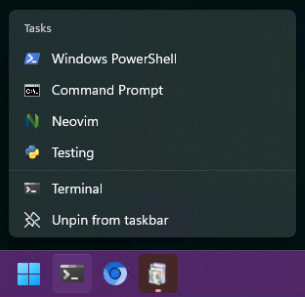
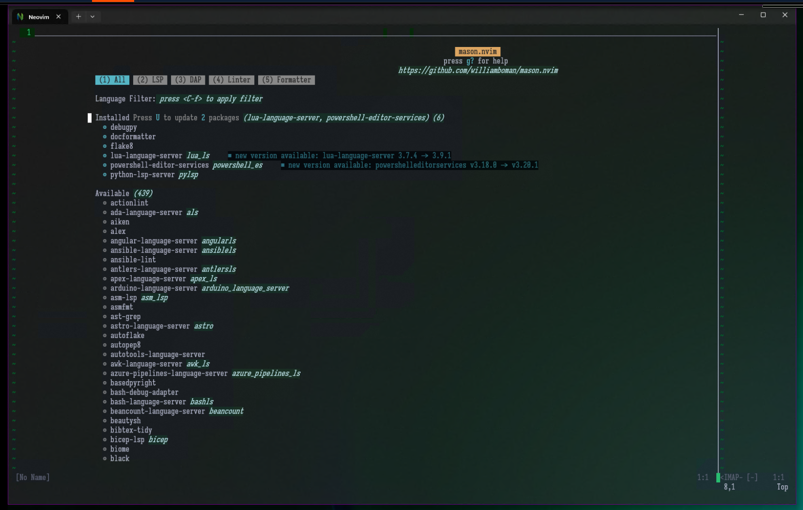
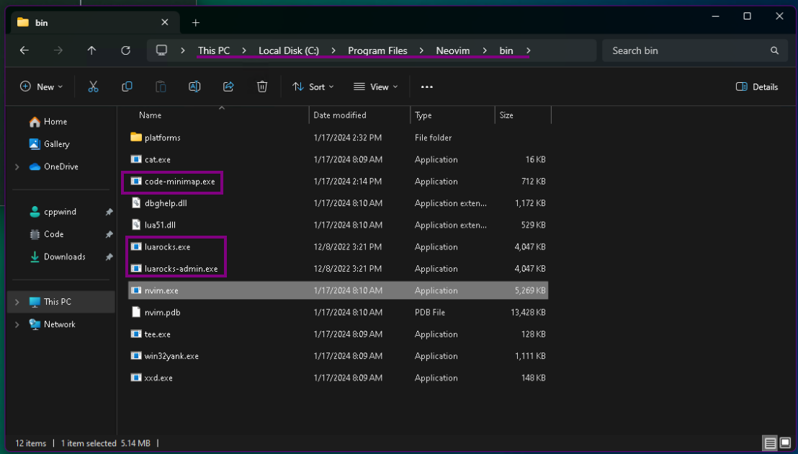
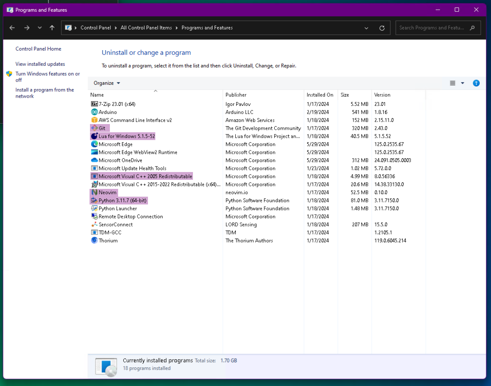

# Neovim in Windows  
_Use a good editor_  

---  

# How it is configured  
  
  
  
  

## Dependencies  
[C++ Redistributable x64](https://aka.ms/vs/17/release/vc_redist.x64.exe)  
[Git for Windows](https://github.com/git-for-windows/git/releases)  
[Lua for Windows](https://github.com/rjpcomputing/luaforwindows/releases)  
[Neovim](https://github.com/neovim/neovim/releases) _Download the nvim-win64.msi_  
[Python for Windows](https://www.python.org/downloads/windows/)  
[TDM64 GCC](https://github.com/jmeubank/tdm-gcc/releases/download/v10.3.0-tdm64-2/tdm64-gcc-10.3.0-2.exe) # _For building language servers on-the-fly_  
